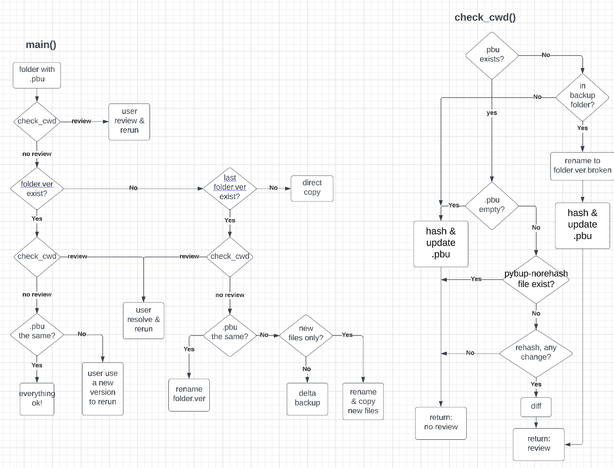

# pbu
simple generic backup script

一个中文说明见[这里](https://wuli.wiki/online/SimBac.html).

* each subfolder `folder` in `src` with `pbu.txt` (initially empty) will be backed up to `dest/folder.pbu/folder.v*`, where `*` is version number `ver`
* `pbu.txt` keeps the info for every file inside, format: `[size] [time] [sha1] [path]`.
* incremental backup will just move identical files from previous version, if any exist
* `lazy_mode`: hash a file only when size or time changed. This will not protect against bit rot, turn off once in a while and rerun.
* \[deprecated\] create an empty file `pbu-norehash` in the same folder with `pbu.txt` to let the script assume folder is up to date and do nochecking at all.

# TODO
* supports encrypted backup, see `encrypt.py`
* in `.pbu` backup folder, every file should only have 1 copy
* all symbolic links are omitted for now!
* should keep `.pbu-old` for incremental backup that only adds new files
* should support AES/m16 encryption (no salt), and replace filenames and folder names with hashes

## make `pbu` more like git! (without staging area)
* `pbu status` to check source folder
* detect renamed files (path and name change without sha1 change)
* `pbu commit` to commit to a new version (15-digit backup time)
* `pbu fsck` to check backup folder (all versions)
* use `.pbuignore` file similar to `.gitignore`
* `pub checkout` to checkout any version
* `pub checkout-pbu` to checkout any version in the `.pbu` folder
