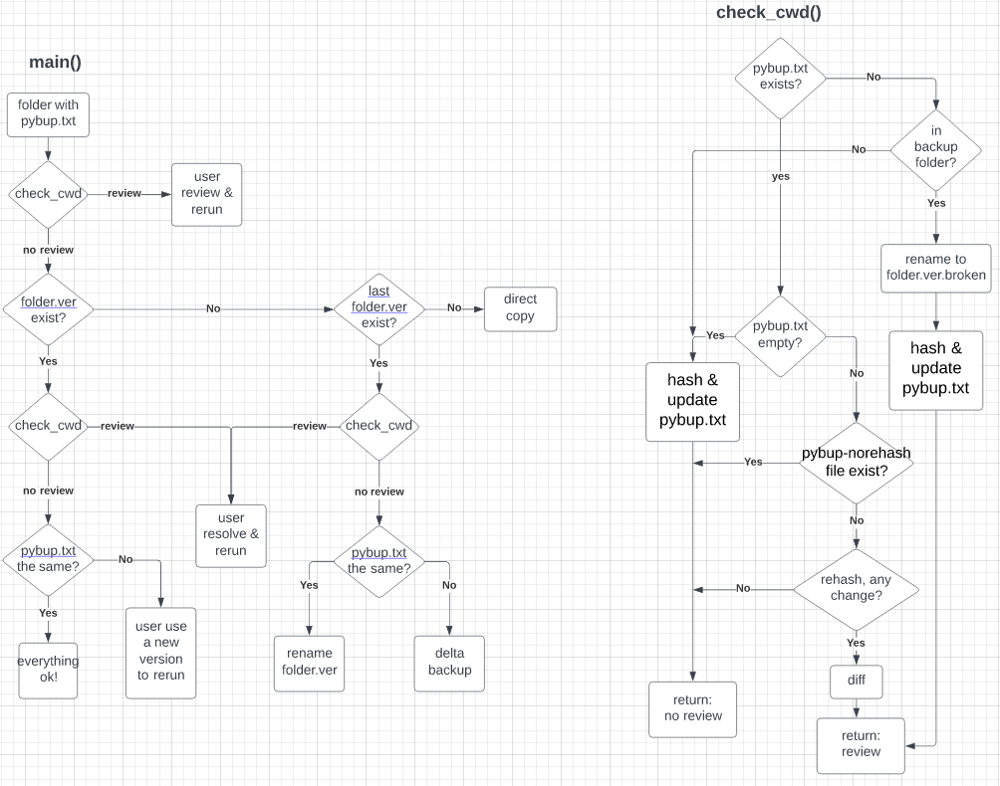

# pybup
simple generic backup script

* each subfolder `folder` in `src` with `pybup.txt` (initially empty) will be backed up to `dest/folder.pybup/folder.v*`, where `*` is version number `ver`
* `pybup.txt` keeps the hash for every file inside, you can manually generate pybup.txt with `find . -type f -exec sha1sum {} \; | sort > pybup-new.txt` (might add file size and time in the future)
* incremental backup will just move identical files from previous version, if any exist

